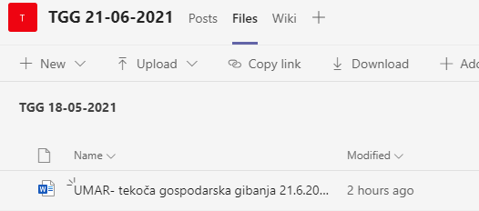
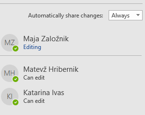

---
output:
        pdf_document
fontsize: 11pt
geometry: a4paper,left=3.5cm,right=3.5cm,top=3.5cm,bottom=4cm
header-includes:
        - \usepackage{fancyhdr}
        - \pagestyle{fancy}
        - \fancyfoot{}
        - \fancyhead[R]{UMAR -- 14.6.2021}
        - \fancyfoot[R]{\thepage}
urlcolor: blue
---
        
\newpage

# Kolaborativno pisanje v Wordu preko MS Teams{-}

Pred vami so kratka navodila za vzpostavitev delovnega okolja za kolaborativno pisanje v Wordu znotraj okolja Microsoft Teams.  

Za to boste potrebovali svoje Maximo uporabniško ime in geslo, ki omogoča dostop do MS Teams in drugih Microsoftovih aplikacij. Če se ju ne spomnite, pošljite e-pošto na ekc@gov.si in prosite za ponastavitev gesla. 

S pomočjo gesla se vpišite v aplikacijo MS Teams. To rabite storiti samo prvič, potem si aplikacija zapomni vašo prijavo. 

{width=50%}

Priporočamo, da jih imate aplikacijo stalno odprto v ozadju, toda če jo zaprete, nič ne skrbite: na e-mail boste dobili obvestilo o vseh sporočilih, ki ste jih zamudili. 

Dodani boste v skupine (team-e) za posamezno publikacijo, kjer sodelujete, in o tem boste tudi prejeli email, npr: 

{width=50%}

V aplikaciji MS Teams boste  na levi strani zdaj tudi videli dodano novo skupino, katere del ste:

{width=50%}

Znotraj vsake skupine je vedno splošen kanal `General`, potem pa poljubno število drugih kanalov, ki jih ustvarite uporabniki. 

Urednik bo za vsako novo publikacijo odprl nov kanal in vas o tem obvestil, če sodelujete pri pisanju ali pri popravkih^[Obvestilo boste dobili preko Teamsov ali preko e-maila, če ga zgrešite tam.]. Hkrati vam bo tudi povedal, da je v skupno uporabo dal Word datoteko, ki jo najdete, tako da najprej na levi strani izberete pravi kanal, potem pa zgoraj izberete zavihek `Files`.

{width=90%}

Tam najdete ime Word datoteke, ki jo iščete in kliknete nanjo. 

{width=80%}

Datoteka se bo odprla kar neposredno v Teamsih, toda če jo želite urejati, jo morate odpreti v navadnem Wordu, torej v namizni aplikaciji. 

To naredite tako, da klikente na puščico poleg `Edit Document` oz. `Uredi dokument` zgoraj desno in izberete `Open in Desktop App` oz. `Odpri v namizni aplikaciji`.

{width=70%}

Tako imate datoteko zdaj odprto v svoji Word aplikaciji, vendar za razliko od situacije, na katero ste navajeni, v njej lahko dela več ljudi naenkrat. 

S klikom na gumb `Share` oz. `Deli` zgoraj desno boste na desni videli, kdo vse sodeluje na dokumentu.

{width=40%}

Sočasno delo v praksi poteka tako, da le z manjšim zamikom vidite spremembe, ki jih v dokument vnašajo vaši soavtorji - in oni vaše. Shranjevanje načeloma ni potrebno, saj se vse spremembe shranijo avtomatično - vkolikor pa se niso, vas bo aplikacija sama opozorila, da jih je potrebno shraniti.

Da ne bi prišlo do navzkrižnega dela na istem odstavku, se posamezen odstavek zaklene za ostale uporabnike, kadar nekdo dela na njem, kar lahko tudi vidite, kot na primer tu: 

{width=50%}

Dogovorjeno je, da _lastnik_ dokumenta -- torej urednik -- vklopi sledenje spremembam in ga _zaklene_: tako ga ne more nihče ponesreči izklopiti. Tako ima samo urednik možnost sprejemati ali zavračati spremembe, ki jih ustvarite ostali avtorji.

Znotraj dokumenta lahko kot običajno dodajate tudi komentarje, hkrati pa imate zdaj za vsako publikacijo na voljo tudi poseben Teams kanal, kjer lahko s soavtorji debatirate o publikaciji. 

Ko je dokument končan in urejen in je skupno delo zaključeno, ga urednik prekopira v ustrezno mapo na G: disku. 

 Lejla Fajić/UMAR/GOV@SVN, Rotija Kmet-Zupančič/UMAR/GOV@SVN, Marta Gregorčič/UMAR/GOV@SVN, Matevž Hribernik/UMAR/GOV@SVN, Urška Brodar/UMAR/GOV@SVN