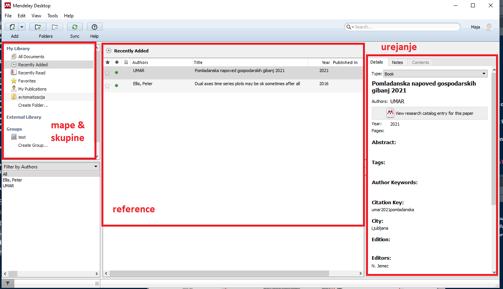
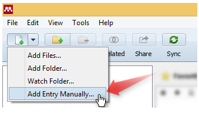
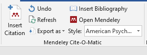

\newpage

# Povzetek 

Pred vami so kratka navodila za vzpostavitev delovnega okolja za kolaborativno pisanje v Wordu in urejanje referenc z Mendeley-em. 

Namenjena so: 

* posameznim avtorjem, ki si želijo bistveno olajšati življenje z uporabo orodja za organizacijo referenc in citiranje;
* skupinam avtorjev, ki si želijo bistveno olajšati življenje z uporabo kolaborativne uporabe Word-a;
* posameznim urednikom, ki si želijo bistveno olajšati življenje z zmanjšanjem količine ročnega dela in koordinacije. 

Glavne funkcionalnosti, ki jih bom pokrili v teh navodilih so:

1. organizacija in vodenje lastne knjižnjice referenc v namiznem programu;
2. sodelovanje v skupni knjižnjici;
3. vstavljanje citatov in bibliografij v Microsoft Word;
4. sodelovanje v skupnem Word dokumentu. 

Navodila predpostavljajo, da delate na službenem računalniku, z vsemi prednostmi in slabostmi, ki jih to prinaša. Če delate v drugem okolju, bo navodila morda potrebno prilagoditi.  

Navodila tudi optimistično predpostavljajo, da imate pri roki svoje Microsoft uporabniško ime in geslo. Če temu slučajno ni tako, vam lahko pomaga Saša.  


# Mendeley

Mendeley je brezplačno orodje za urejanje referenc. Začetna investicija časa in energije, potrebna za vzpostavitev knjižnjice in spoznavanje okolja, se večini poplača že prvi dan uporabe.

Za bolj podrobna navodila in več funkcionalnosti, kot jih omenjamo tukaj, na spletu ne manjka kvalitetnih virov npr.:

1. [Tile kratki videi v angleščini](https://www.youtube.com/watch?v=qRiAIaqdAOg&list=PLF3A4B2A1099D2016);
2. [Tale opisna navodila v slovenščini](https://libguides.ukm.um.si/mendeley/uvod).


## Setup

Pred pričetkom uporabe Mendeley-a morate:

1. registrirati brezplačen račun na spletni strani [mendeley.com](mendeley.com);
2. prenesti in namestiti namizno aplikacijo Mendeley Desktop.


### Registracija na Mendeley Web

1. Na spletni strani [mendeley.com](mendeley.com) kliknite na _Create account_ zgoraj desno. 
2. V obrazec vnesite svoj email naslov in kliknite _"Continue"_. ^[Verjetno je najbolj enostavno, da uporabite svoj @gov.si naslov. Če ga boste kdaj v prihodnje želeli spremeniti, to seveda lahko storite.]
3. V obrazec vnesite svoje ime in priimek ter si izberite primerno geslo, nato kliknite _"Register"_. 
4. V naslednjem obrazcu lahko vnesete tudi svoj status in raziskovalno področje, lahko pa ta del tudi preskočite.
5. Sedaj ste prijavljeni v spletni portal: zgoraj desno vidite svoje ime, zraven pa zavihek 
_Library_, kjer bo shranjena vaša knjižnjica.

NB: Mendeley Web in Mendeley Desktop imata veliko enakih funkcionalnosti. Glavni razlog, da bomo zdaj namestili tudi namizno verzijo, je ker omogoča lokalno shranjevanje dokumentov - če se zanašamo samo na spletno verzijo, smo omejeni na 2 GB. 

### Namestitev namiznega orodja Mendeley Desktop

1. Na strani [https://www.mendeley.com/download-desktop-new/](https://www.mendeley.com/download-desktop-new/) prenesemo najnovejšo verzijo programa s klikom na _"Download Mendeley Desktop for Windows"_. 
2. Po končanem prenosu dvakrat kliknemo na datoteko in sledimo navodilom. Pri tem lahko pustimo vse privzete nastavitve.^[Nisem ziher, a se da sploh brez admin pravic inštalirat, ker se ne spomnim.. Če ne, rabiš Sašo.]
3. Po uspešni namestitvi odpremo program in se vpišemo z emailom in geslom, ki smo ga ustvarili malo prej. 
4. Na tej točki imamo možnost uvoziti obstoječe knjižnjice ali pdf datoteke, toda mi bomo kliknili _"Skip"_ in preskočili to možnost. 

## Organizacija lastne knjižnjice

Na spodnji sliki so označeni trije glavni pogledi znotraj naše knjižnjice:

1. mape in skupine na levi strani
2. reference na sredini
3. obrazec za urejanje posameznih referenc

```{r, echo = FALSE}

```

Če želite si lahko reference organizirate v mape in podmape, vedno pa boste s klikom na _"All documents"_ zgoraj levo videli vse reference v vaši knjižnjici. 

Seznam referenc na sredini lahko na hitro razvrstite glede na avtorja, naslov ali letnico s klikom na vrh ustreznega stolpca.

Posamezno referenco lahko urejate na desni strani.  

### Uvoz referenc v Mendeley

1. Najenostavneje referenco vnesemo v Mendeley tako, da pdf dokument enostavno povlečemo v knjižnjico in program bo naredil avtomatično ekstracijo podatkov. Ta metoda ne deluje vedno 100 %, saj temelji na pravilno izpolnjenih metapodatkih v pdf-ju, _zato vedno preverite podatke_ v desnem okencu in jih po potrebi popravite. 

2. Za _ročni vnos referenc_ kliknemo na _"Add Entry Manually"_ na meniju zgoraj desno. V obrazcu, ki se pojavi, izpolnimo vsa željena polja. Če bomo polja pustili prazna, teh podatkov tudi v bibliografiji ne bo!

```{r, echo = FALSE}

```

3. Mendeley omogoča še vrsto drugih načinov vnosa dokumentov, od uvoza knjižnjic do zelo uporabnega dodatka v spletnem brskalniku ali pa spremljanja določene mape in avtomatičnega uvoza vseh dokumentov, ki jih tja shranite. Več info je na voljo v Slovenščini na [tej povezavi](https://libguides.ukm.um.si/mendeley/uvoz). 

## Skupna knjižnjica

### Navodila za so-avtorje

1. Ko vas urednik povabi v skupino, boste prejeli email z zadevo: "Mendeley: Group invitation request".
2. Kliknite _"Join this group"_ in odprla se vam bo stran v brskalniku. 
3. Pod "Pending invites" kliknite _"Accept"_ in tako sprejmite vabilo. 
4. Sedaj se vam bo na desni strani pod naslovom _"Groups"_ pojavilo ime nove skupine. Če želite referenco iz svoje knjižnjice deliti s skupino, jo preprosto povlečete vanjo. 
5. Hkrati boste v skupni knjižnjici videli vse reference, ki so jih vanji shranili drugi člani skupine. 

### Navodila za urednike

NB: zastonj verzija Mendeleya ima omejitev, da je v posamezni skupni knjižnjici naenkrat največ 25 oseb. Upoštevajte to pri ustvarjanju novih skupnih knjižnjic in vabljenju ljudi v skupine. 

Skupino ustvarite s klikom na _"Create Group..."_ na levi strani zaslona. Skupini daste ime in potem lahko vanjo povabite so-avtorje preko email naslovov.  

# Vstavljanje citatov in bibliografij v Microsoft Word

## Setup

Ker imamo nameščeno namizno verzijo Mendeley-a, je za integracijo z MS Wordom potrebno namestiti dodaten plug-in za citiranje:

1. V Mendeleyu izberemo _Tools/Install MS Word Plugin_ 
2. Dodatek se bo samodejno namestil. 

## Uporaba

1. Odpremo MS Word. 
2. Pod zavihkom _"References"_ (Sklici) se sedaj nahaja nov razdelek _"Mendeley Cite-O-Matic"_ s pomočjo katerega lahko vstavljamo reference. 

```{r, echo = FALSE}

```

3. S klikom na gump "Instert Citation" se odpre iskalno okence, v katerem poiščete vir, ki ga želite uporabiti in s klikom na "OK", se referenca samodejno vstavi v besedilo. 

4. Klik na gumb _"Insert Bibliography"_ na koncu besedila ustvari bibliografijo vseh virov uporabljenih v besedilu. 

5. Če želimo spremeniti stil citiranja, to storimo s klikom na gumb _"Style"_. NB: privzeti stil na UMAR-ju je APA oz. American Psychological Association.

_To je to!_

NB: reference in bibliografija se vse samodejno posodabljajo vsakič, ko vnesete novo referenco. S klikom na gumb _"Refresh"_ pa lahko posodobite stanje kadar želite. 

NB: če delate na kolaborativnem dokumentu in uporabljate skupno knjižnico, bodite pozorni pri prvem kliku na _"Insert Citation"_, da imate izbrano pravilno knjižnico. 

# Kolaboraivno pisanje z Word online

Za zadnji korak boste potrebovali svoje Microsoft uporabniško ime in geslo. NB: gre za isto avtentikacijo, kot jo uporabljate za MS Teamse. Če se je ne spomnite, potem prosite Sašo, da vas opomni. 

## Setup 

### Navodila za so-avtorje


### Navodila za urednike