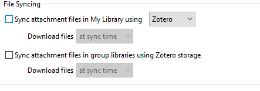

\newpage

# Povzetek 

Pred vami so kratka navodila za vzpostavitev delovnega okolja za kolaborativno pisanje v Wordu in urejanje referenc z Zotero-m. 

Namenjena so posameznim avtorjem, skupinam avtorjev in posameznim uredinkom, ki si želijo bistveno olajšati življenje in zmanjšati količino ročnega dela in koordinacije. 

Glavne funkcionalnosti, ki jih ta navodila pokrivajo so:

1. organizacija in vodenje lastne knjižnice referenc v namiznem programu;
2. sodelovanje v skupni knjižnici;
3. vstavljanje citatov in bibliografij v Microsoft Word;
4. sodelovanje v skupnem Word dokumentu. 

Navodila predpostavljajo, da delate na službenem računalniku, z vsemi prednostmi in slabostmi, ki jih to prinaša. Če delate v drugem okolju, bo navodila morda potrebno prilagoditi.  

Navodila tudi optimistično predpostavljajo, da imate pri roki svoje Microsoft uporabniško ime in geslo. Če temu slučajno ni tako, vam lahko pomaga Saša.  


# Zotero

Zotero je brezplačno orodje za urejanje referenc. Začetna investicija časa in energije, potrebna za vzpostavitev knjižnice in spoznavanje okolja, se večini poplača že prvi dan uporabe.

Za bolj podrobna navodila in več funkcionalnosti, kot jih omenjamo tukaj, na spletu ne manjka kvalitetnih virov npr.:

1. [Getting started navodila v angleščini](https://www.zotero.org/support/quick_start_guide);
2. [Uprabna zbirka kratkih videov v angleščini](https://www.youtube.com/playlist?list=PLBzFFB2hT9f6k70rjtAiQGXxZ_7SEJDYc).
3. [Navodila s praktičnimi primeri v slovenščini](https://bistra.si/images/raziskovalne-naloge/Uporaba_orodja_za_organizacijo_referenc_in_citiranja.pdf)


## Setup

Pred pričetkom uporabe Zotera morate:

1. prenesti in namestiti namizno aplikacijo Zotero in

2. odpreti račun na strani zotero.org

Priporočamo tudi, da si namestite vtičnik za brskalnik, ki vam bo olajšal vnašanje novih virov v vašo knjižnico. 

### Namestitev namiznega orodja Zotero - domači računalnik 

_Na službenem računalniku vam bo z namestitvijo pomagala Saša, saj potrebujete administratorske pravice._

1. Iz strani [https://www.zotero.org/download/](https://www.zotero.org/download/) prenesite najnovejšo verzijo programa s klikom na gumb _"Download"_ na levi strani ekrana.

2. Po končanem prenosu dvakrat kliknite na datoteko in sledite navodilom. Pri tem lahko pustite vse privzete nastavitve.

### Registracija na Zotero.org

1. Na spletni strani [zotero.org](https://www.zotero.org/) kliknite na _Log in_ zgoraj desno in nato na _"Register for a free account"_.
2. Izberite si uporabniško ime, vnesite svoj `@gov.si` e-mail naslov in si izberite primerno geslo in kliknite  _"Register"_. 
3. Sedaj ste prijavljeni v spletni portal: zgoraj desno vidite svoje ime, na levi strani pa zraven pa zavihek 
_Web Library_, kjer bo shranjena vaša knjižnica.^[Spletna Zotero knjižnica in namizna aplikacija imata veliko enakih funkcionalnosti. Glavni razlog, da bomo zdaj namestili tudi namizno verzijo, je ker omogoča lokalno shranjevanje dokumentov - če se zanašamo samo na spletno verzijo, smo omejeni na 300 MB.]
4. Na e-mail boste prejeli potrditveni e-mail, kjer potrdite svojo istovetnost s klikom na link. 


### Namestitev vtičnika za brskalnik 

_Ta namestitev ni obvezna, vam bo pa vzela par sekund in prihranila ogromno časa v prihodnje_

1. Na strani [https://www.zotero.org/download/] kliknite na _Install Chrome Connector_ na desni strani ekrana (oz. connectorja za vaš izbrani brskalnik) in sledite navodilom. 
2. Ikonico vtičnika boste sedaj videli v svojem brskalniku in s klikom nanjo se bo .pdf dokument ali spletna stran na kateri ste, avotmatično shranila v izbrano knjižnico:

```{r, echo = FALSE}

```

## Organizacija lastne knjižnjice

Na spodnji sliki so označeni trije glavni pogledi znotraj naše knjižnice:

1. mape in skupine na levi strani
2. reference na sredini
3. obrazec za urejanje posameznih referenc


Če želite si lahko reference organizirate v mape in podmape, vedno pa boste s klikom na _"My Library"_ zgoraj levo videli vse reference v vaši knjižnici. 

Seznam referenc na sredini lahko na hitro razvrstite glede na avtorja, naslov ali letnico s klikom na vrh ustreznega stolpca.

Posamezno referenco lahko urejate na desni strani.  

### Nastavitve v Zoteru

Ob prvi uporabi Zotera ga morate povezati z vašim računom in nastaviti par nastavitev: 

1. Izberite _Edit/Preferences_ in nato zavihek _Sync_, kjer vnesete svoje uporabniško ime in geslo. 

2. Nato izklopite sinhronizacijo celotnih datotek _Sync full-text content_ - to pomeni, da se shranjene .pdf ali druge datoteke ne bodo shranjevale na spletu, le na vašem računalniku. 

```{r, echo = FALSE}

```

3. Na zavihku _Cite_ izberite stil citiranja. Na UMAR-ju uporabljamo APA, toda ne najnovejšega, temveč 6. edicijo brez ampersanda (znaka &). Ta stil ni med osnovnimi, ki jih imate na izbiro, Zato ga morate najprej prenesti tako da kliknete na _"Get additional styles"_ in ga potem poiskati, najlažje tako da iščete besedo "ampersand" in potem izberete _American Psychological Association 6th edition (no ampersand)_. 


```{r, echo = FALSE}

```

4. Po želji lahko spremenite tudi jezik v slovenščino tako da pod _Edit/Preferences_ izberete zavihek _Advanced_ in pod _Language_ **s pomočjo miške, ne tipkovnice** izberete slovenščino - program se bo ponovno zagnal za uveljavitev sprememb. 

5. Pod _Advanced_ lahko na zavihku _"Files and folders"_ tudi vidite ali spremenite lokacijo, kamor se shranjujejo vse datoteke v vaši kjnižnici. Privzeta lokacija je C:/Users/<uporabniško ime>/Zotero. ^[Tudi če imate .pdf že shranjen na računalniku, se bo po uvozu reference v Zotero, v to mapo shranila njegova kopija.]

### Uvoz referenc v Zotero

Vaša privzeta knjižnica v Zoteru se imenuje _"My Library"_ in znotraj nje lahko reference dodatno organizirate v mapah oz. zbirkah (Collections). S klikom na _"My Library"_ boste vedno videli vse zapise v svoji knjižnici.    

```{r, echo = FALSE}

```


Zapise lahko v Zotero vnašate na različne načine: mogoče najenostavnejši je, da pdf dokument enostavno povlečete v knjižnico in program bo naredil avtomatično ekstrakcijo podatkov in ustvaril zapis. 

* Ta metoda ne deluje vedno 100 %, saj temelji na pravilno zavedenih metapodatkih v pdf-ju, _zato vedno preverite podatke_ v desnem okencu in jih po potrebi popravite. (glej Prilogo A za zahtevana polja). 
* Včasih metoda sploh ne bo delovala, ker Zotero ne bo zaznal nobenih metapodatkov, ali zapisa ne bo našel v katalogih in indeksih. Takrat bo shranil samo pdf kot priponko in v desnem okencu ne boste mogli dodajati metapodatkov. V tem primeru je potrebno ročno dodati zapis tako da z desnim klikom izberete možnost _"Create Parent Item..."_ in potem izbrati možnost _"Manual entry"_. Na desni strani ekrana lahko sedaj urejate referenco in dodate manjkajoče podatke. 

Za _ročni vnos referenc_ kliknete na _"File/New Item"_ na meniju zgoraj desno, ali na ikonico z zelenim plus simbolom. Izberete tip vira in v obrazcu, ki se odpre na desni strani, izpolnite vsa želena polja. 

```{r, echo = FALSE}

```

Ikonica na desni od zelenega plus simbola pa vam omogoča, da vnesete doi ali ISBN številko in pustite Zoteru, da poišče potrebne informacije na ta način. 

V spletnem brskalniku imate nameščen tudi Zotero vtičnik, ki ga lahko uporabljate tako za uvoz posameznih pdf dokumentov, kot tudi za uvoz večjega števila referenc, npr. med iskanjem na Google Scholarju ali drugem katalogu. S klikom na ikonico v brskalniku se bo(do) izbran(i) dokument(i) prenesli v vašo knjižnico. 

Zotero vam sam ne bo preprečil vnosa reference, ki jo že imate v knjižnici, lahko pa s klikom na _"Duplicate Items"_ pod seznamom zbirk v vaši knjižnici vidite, kateri zapisi so podvojeni in jih potem združite s klikom na _"Merge"_. 

[Tale video v angleščini](https://www.youtube.com/watch?v=tf8AdMwlM64&list=PLBzFFB2hT9f6k70rjtAiQGXxZ_7SEJDYc&index=5) lepo povzema vse možnosti uvoza virov. 

## Skupna knjižnjica

Za potrebe skupnega urejanja publikacij smo vzpostavili skupno UMAR knjižnico. Zdaj, ko ste registrirani na strani zotero.org, vam bomo poslali vabilo. Prejeli boste mail z zadevo _"Zotero Group Invitation"_ v katerem je link za potrditev vabila. Po avtentikaciji kliknite na gumb _"Join"_ in boste postali član skupine.

1. V Zoteru  z zeleno okroglo puščico v zgornjem desnem kotu sinhronizirate podatke v oblaku s podatki na vašem računalniku. Zdaj boste na levi strani pod naslovom _"Group Libraries"_ videli ime nove skupine: _UMAR_. 
```{r, echo = FALSE}

```

2. Če želite referenco iz svoje knjižnice dodati v skupno knjižnico, jo preprosto povlečete vanjo. Tako bo ostala v vaši knjižnici, a hkrati bo dostopna tudi za ostale člane skupine. 

3. Hkrati boste v skupni knjižnici videli vse reference, ki so jih vanjo shranili drugi člani skupine - če so jih dodali nedavno, bo klik na ikonico za sinhronizacijo poskrbel, da se prenesejo tudi k vam. 

4. V skupni knjižnici UMAR imajo vsi člani pravico dodajati ali brisati reference. Zato:

* pred prenosom reference iz svoje v skupno knjižnico preverite ali morda že obstaja, da si prihranite delo (in se ne podvajajo zapisi);
* bodite previdni pri brisanju referenc, sploh, če jih niste vnesli vi sami;
* ne skrbite, zapisov v _"My Library"_ vam ne more zbrisati nihče razen vas samih. Če to ponesreči storite, lahko zapis še vedno najdete v košu (_"Bin"_) in ga obnovite.  


# Vstavljanje citatov in bibliografij v Microsoft Word

S pomočjo vtičnika lahko reference, ki so shranjene Zoteru, neposredno uporabljate v Wordu^[Ali pa v Libre Office-u, LaTeX-u.]. Vtičnik se v nekaterih primerih namesti sam, včasih pa ga je potrebno dodatno aktivirati. Ko je pravilno nameščen, boste v Wordu videli dodatno orodno vrstico:


## Setup

Če te orodne vrstice ne vidite, potem v Zoteru izberite  _"Preferences/Cite/"_ in izberite zavihek _"Word Processors"_. Tam izberite gumb _"Install Microsoft Word Add-in"_ in dodatek se bo samodejno namestil. 

## Uporaba

1. Odprete MS Word, kjer poiščete nov zavihek _"Zotero"_ (glej zgornjo sliko) s pomočjo katerega lahko vstavljate reference. 


2. Ko v dokumentu prvič kliknete na gumb "Add/Edit Citation" vas Zotero vpraša kateri stil citiranja želite uporabljati. Po dogovoru se za naše publikacije uporablja APA - torej _"American Psychological Association 6th edition (no ampersand)"_ in za jezik seveda izberite slovenščino. 

3. Potem se vam bo odprlo iskalno okence, kamor lahko začnete vpisovati del **naslova**, **avtorjev** ali **letnice** reference, ki jo iščete in na seznamu se vam bodo prikazale reference, ki ustrezajo iskalnemu pogoju. Pri delu v skupnih dokumentih bodite pozorni, da uporabite referenco iz skupne knjižnice UMAR, sicer lahko pride do podvajanja zapisov v bibliografiji. 


```{r, echo = FALSE}

```

4. Alternativno iskanje referenc je mogoče s klikom na malo puščico zraven črke z (glej sliko spodaj) in izbiro _"Classic view"_, 


kjer ravno tako lahko iščete reference, hkrati pa lahko še dodatno prilagodite citat.


5. S klikom na gumb _"Show editor"_ spodaj levo lahko vidite kako bo zgledala vaša navedba vira, ki ji lahko dodate besedilo pred ali po, ali pa stran oz. poglavje. 


6. Za vstavljanje bibliografije oziroma seznama virov se postavite (običajno) na konec besedila in kliknite na gumb _"Add/Edit Bibliography"_. Samodejno se vam bo ustvarila bibliografija, če jo želite dodatno ročno urejati, pa lahko to storite s klikom na isti gumb. ^[Dodatno urejanje bo spremenilo samo reference kot so zapisane v bibliografiji, ne pa v vaši Zotero kjnižnici.]


_To je to!_

_Reference in bibliografija se vse samodejno posodabljajo vsakič, ko vnesete novo referenco. S klikom na gumb "Refresh" pa lahko posodobite stanje kadar želite._


# Kolaborativno pisanje v Wordu

Za zadnji korak boste potrebovali svoje Microsoft uporabniško ime in geslo (geslo za aplikacijo Maximo). Če se je ne spomnite, pošljite e-pošto na ekc@gov.si in prosite za ponastavitev gesla. 

## Setup 

### Navodila za so-avtorje

Prejeli boste e-mail z zadevo npr."Maja Založnik shared "test" with you", ki ga odprete in kliknete na gumb _"Open"_. Odprl se bo brskalnik in morali boste vnesti svoje uporabniško ime in geslo. 

Word datoteka v skupni rabi se vam je zdaj odprla v brskalniku v tako imenovanem "Online Wordu". Online Word deluje zelo podobno kot Google docs in je zelo uporaben, vendar ima manj funkcionalnosti kot namizna aplikacija Word: predvsem v njem ne dela vtičnik za Zotero. 

Zato morate deljeno datoteko odpreti v namizni aplikaciji, tako kliknete na 
_"Editing/Open in Desktop App"_ oz. _"Urejanje/Odpri v namizni aplikaciji"_ 
{width=50%} {width=60%}

Tako imate datoteko odprto v svojem Word dokumentu, kar pomeni, da dostopate do Zotero vtičnika, hkrati pa na isti datoteki lahko hkrati dela več ljudi naenkrat. 

S klikom na gumb _"Share"_ ali _"Deli"_ zgoraj desno, boste na desni videli kdo vse sodeluje na dokumentu.

```{r, echo = FALSE}
knitr::include_graphics("../images/zotero14.png")
```

Sočasno delo v praksi poteka tako, da je odstavek, ki ga nekdo ureja, "zaklenjen" za ostale, tako da zaradi rahlega zamika ne bi prišlo do navzkrižnega dela. Seveda je tudi pri tej obliki dela mogoče uporabljati sledenje spremembam, komentiranje in vse ostale funkcionalnosti Worda, ki ste jih že navajeni. 

### Navodila za urednike

Če kot "lastnik" dokumenta, želite k delu na njem povabiti druge avtorje, ga boste morali najprej shraniti na OneDrive. Najlažje to naredite tako, da v dokumentu samem kliknete na gumb _"Share"_ ali _"Deli"_ zgoraj desno, nakar boste pozvani, da dokument shranite v oblaku.

```{r, echo = FALSE}

```

Tam izberite _"One Drive - Ministrstvo za javno upravo"_ in shranite dokument tja. 

```{r, echo = FALSE}

```

Sedaj je dokument shranjen na oblaku in dostopen avtorjem, ki jih povabite. To storite v desnem panelu (če ga ne vidite, ponovno kliknite na gumb _"Share"_ ali _"Deli"_ zgoraj desno), tako da vnesete njihove @gov.si e-mail naslove in prejeli bodo vabilo. 

# Priloga A: Obvezna polja za pravilen vnos referenc   {-}

[...]